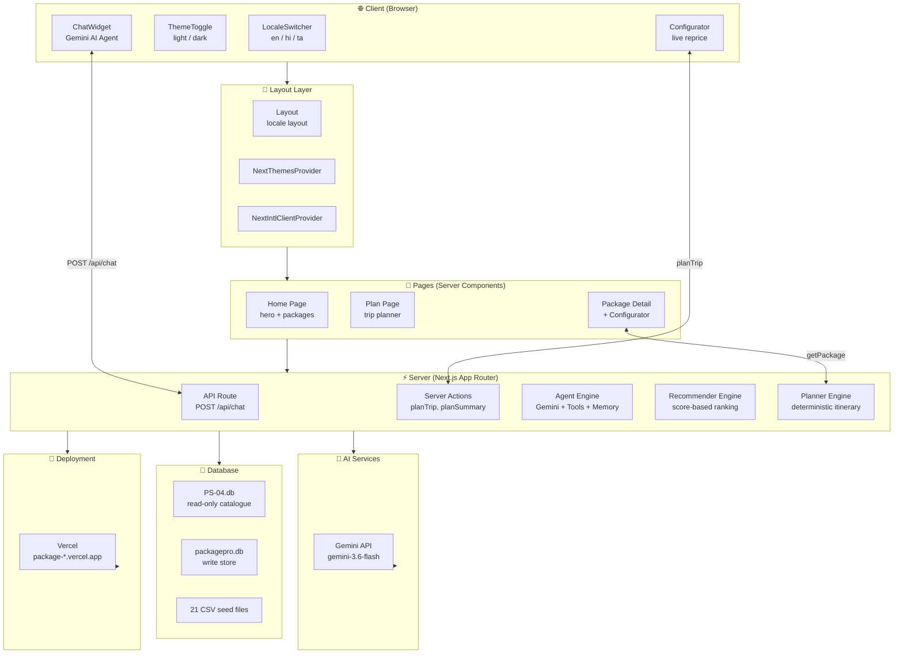
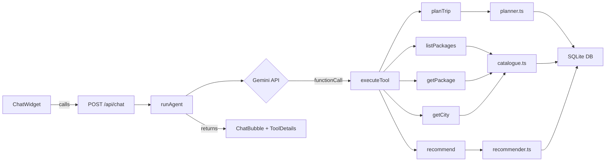
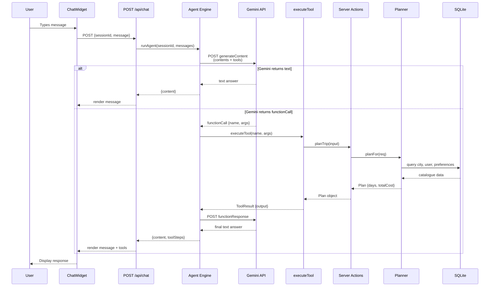
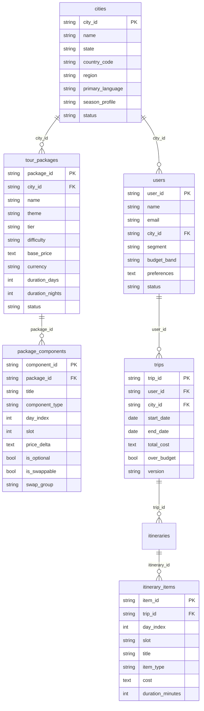
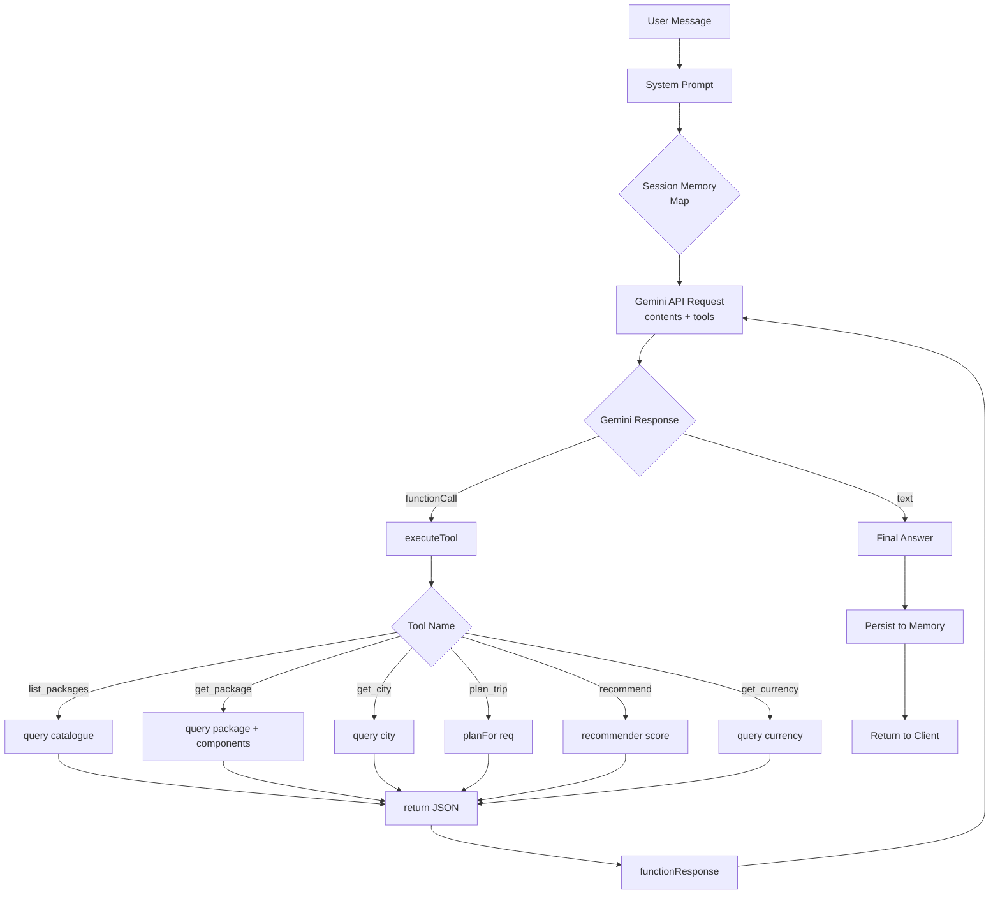
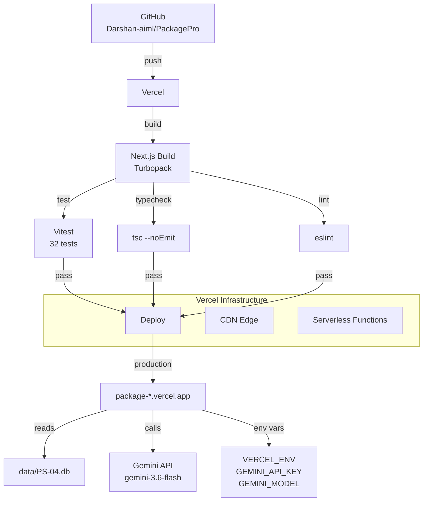
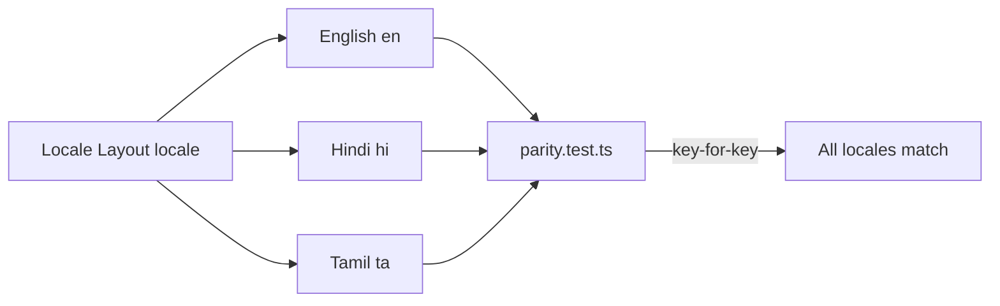
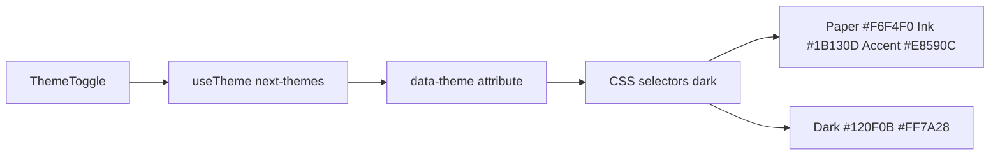
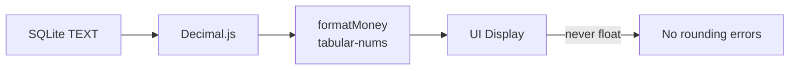
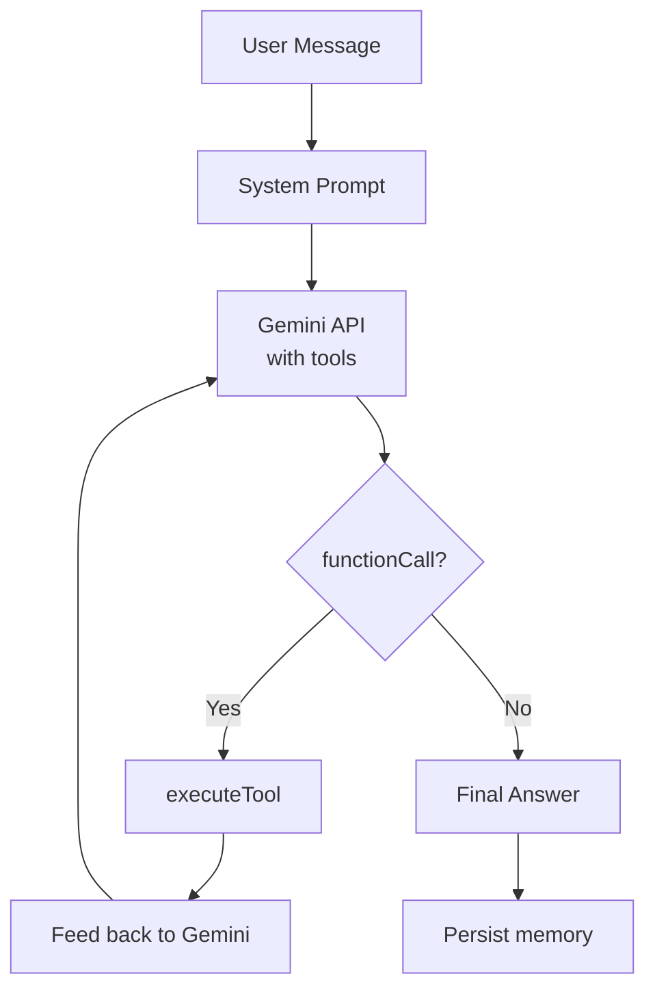

# PackagePro

> Dynamic tour packages that reprice as you swap stops. Deterministic engine, exact money, AI-powered planning agent.

[](https://nextjs.org/)
[](https://www.typescriptlang.org/)
[](https://tailwindcss.com/)
[](https://vercel.com/)
[](https://ai.google.dev/)
[](https://pnpm.io/)
[](https://sqlite.org/)
[](https://opensource.org/licenses/MIT)

**Live:** [package-h8nxlnxg3-dhanush3904p-2654s-projects.vercel.app](https://package-h8nxlnxg3-dhanush3904p-2654s-projects.vercel.app)

---

## Project Overview

**Project name:** PackagePro

**Problem statement:** Static tour packages don't reprice when travellers swap stops, hotels, guides, or dates. Existing platforms lock users into fixed itineraries — changing a single stop invalidates the entire pricing model.

**Target users:** Travellers planning tours across India and the Himalayas who want dynamic, component-swappable itineraries with exact pricing.

**Core solution:** A deterministic travel planning engine where every component (hotel, guide, transfer, POI) is individually priced and the total recomputes live as stops change — powered by SQLite, internationalized for three languages, with a Gemini-powered AI agent.

**Key value proposition:** Swap any component → see the exact INR total reprice instantly. No guessing, no float arithmetic, no stale pricing.

**30-second pitch:**

> PackagePro lets travellers build tours by swapping individual components — hotels, guides, transfers, activities — and see the exact total reprice in real-time. It's a deterministic engine backed by a SQLite catalogue, internationalized for English, Hindi, and Tamil, with a Gemini-powered AI agent that can plan trips, recommend packages, and answer travel questions grounded in real catalogue data.

---

## Architecture Diagrams

### High-Level System Architecture



### Component Responsibility Map



### End-to-End Data Flow



### Database ER Diagram



### AI/ML Pipeline Diagram



### Deployment Architecture



---

## Tech Stack

| Layer | Technology | Purpose |
|---|---|---|
| **Framework** | Next.js 16 (App Router, Turbopack) | SSR, routing, server components |
| **Language** | TypeScript (strict mode) | Type safety |
| **Styling** | Tailwind CSS v4 (`@theme inline` tokens) | Design system, dark mode |
| **Animations** | `motion/react` (Framer Motion) | Apple-style spring animations |
| **i18n** | `next-intl` v4 | English, Hindi, Tamil routing + messages |
| **Database** | SQLite via `node:sqlite` | Zero-dependency persistence |
| **Money** | `Decimal.js` via `@/lib/money` | Exact decimal arithmetic |
| **AI** | Gemini `gemini-3.6-flash` | Function-calling agent |
| **Testing** | Vitest | Unit + integration + parity tests |
| **Linting** | ESLint | Code quality |
| **Type Checking** | `tsc --noEmit` | Static analysis |
| **Package Manager** | pnpm workspaces | Dependency management |
| **Deployment** | Vercel | Hosting, CI/CD |
| **Environment** | `.env.local` | Secrets management |

---

## Quick Start

```bash
# Install dependencies
pnpm install

# Copy environment file
cp .env.example .env.local
# Add GEMINI_API_KEY and GEMINI_MODEL to .env.local

# Start development server
pnpm dev          # → http://localhost:3000

# Run tests
pnpm test         # 32 tests

# Full verification (typecheck + lint + test)
pnpm verify

# Build for production
pnpm build

# Deploy to Vercel
vercel --prod
```

---

## Key Features

### 🌐 Internationalization (3 Languages)


### 🎨 Theme System (Light/Dark)


### 💰 Money System (Exact Decimal)


### 🤖 AI Agent (Gemini + Tools)


---

## API Design

### Endpoints

| Method | Endpoint | Purpose | Auth | Request | Response |
|---|---|---|---|---|---|
| `POST` | `/api/chat` | Gemini agent chat | None | `{sessionId, message}` | `{content, toolSteps, usedTools, sessionId}` |
| `GET` | `/[locale]/` | Home page | None | — | HTML page |
| `GET` | `/[locale]/plan` | Trip planner | Cookie | — | HTML page |
| `GET` | `/[locale]/packages/[id]` | Package detail | None | — | HTML page |

### Chat API Detail

**Request:**
```json
POST /api/chat
Content-Type: application/json

{
  "sessionId": "uuid-v4",
  "message": "Plan a 3-day trip to Goa for 2 adults"
}
```

**Success Response:**
```json
{
  "content": "Based on the tool results...",
  "toolSteps": [
    {
      "toolCallId": "uuid",
      "name": "plan_trip",
      "args": {"cityId": "...", "startDate": "...", "adults": 2},
      "result": {"output": "{...plan JSON...}"}
    }
  ],
  "usedTools": true,
  "sessionId": "uuid-v4"
}
```

**Error Cases:**
- `{"error": "message is required"}` — 400, missing message
- `{"error": "Gemini 429"}` — rate limit from Gemini API
- `{"error": "Gemini 400"}` — malformed request to Gemini
- `{"error": "Agent failed"}` — unexpected error

---

## Database Design

### Schema Summary

| Table | Primary Key | Foreign Key | Key Fields |
|---|---|---|---|
| `cities` | `city_id` | — | `name`, `country_code`, `region`, `primary_language`, `status` |
| `tour_packages` | `package_id` | `city_id → cities.city_id` | `name`, `theme`, `tier`, `base_price TEXT`, `currency`, `difficulty`, `duration_days` |
| `package_components` | `component_id` | `package_id → tour_packages.package_id` | `title`, `component_type`, `day_index`, `price_delta`, `is_optional`, `is_swappable`, `swap_group` |
| `users` | `user_id` | `city_id → cities.city_id` | `name`, `segment`, `budget_band`, `preferences`, `status` |
| `trips` | `trip_id` | `user_id`, `city_id` | `total_cost`, `overBudget`, `budget`, `version` |
| `itinerary_items` | `item_id` | `trip_id → trips.trip_id` | `day_index`, `slot`, `title`, `itemType`, `cost`, `durationMinutes` |

### Data Files

- `data/PS-04.db` — SQLite catalogue (read-only)
- `data/packagepro.db` — Write store for trips, itineraries, bookings
- `data/csv/` — 21 seed CSV files (amenities, categories, currencies, languages, hotels, packages, etc.)
- `data/enums.json` — Enumeration definitions

### Money Handling

All money fields are stored as `TEXT` in SQLite. The `@/lib/money` module uses `Decimal.js` for exact decimal arithmetic. Prices are never computed as floats.

```typescript
// Example: exact decimal arithmetic
import { d } from "@/lib/money";
const total = d("1620.78").plus(d("385.31")).toFixed(2); // "2006.09"
```

---

## AI/ML Architecture

### Agent Engine (`src/server/agent/chat.ts`)

| Component | Detail |
|---|---|
| **Model** | `gemini-3.6-flash` via `generativelanguage.googleapis.com` |
| **System Prompt** | Warm adventure-luxury travel advisor persona, strict grounding rules |
| **Tools** | `list_packages`, `get_package`, `get_city`, `plan_trip`, `recommend`, `get_currency` |
| **Memory** | `Map<sessionId, AgentMessage[]>` — in-process conversation history |
| **Loop** | Up to 4 rounds: send → Gemini calls tool → execute → feed back → final answer |
| **Generation Config** | `temperature: 0.6`, `topP: 0.9`, `maxOutputTokens: 2048` |

### Tool Definitions

| Tool | Responsibility | Returns |
|---|---|---|
| `list_packages` | Filter packages by theme/tier/city | Array of package summaries |
| `get_package` | Full package details + components | Complete package object |
| `get_city` | Destination info + available packages | City object with packages |
| `plan_trip` | Deterministic itinerary | Plan with days, hotel, guide, total |
| `recommend` | Personalized picks | Ranked recommendations |
| `get_currency` | Currency metadata | Currency row |

### Recommender Engine

```
Strategy is gated on users.segment:

cold_start → language-filtered popularity + "we know little yet"
heavy/light → filters (language, budget→tier, city) → scoring
  (interests · pace · price-proximity) → tiebreak (languages covered)
```

---

## Testing

| Test Type | Framework | Count | Status |
|---|---|---|---|
| Unit tests | Vitest | 26 | ✅ Passing |
| Money tests | Vitest | 6 | ✅ Passing |
| Parity tests | Vitest | 2 | ✅ Passing |
| **Total** | | **32** | **✅ All passing** |

```bash
pnpm test         # Run all tests
pnpm verify       # typecheck + lint + test
```

### Test Coverage

- **Engine tests:** `planner.test.ts`, `recommender.test.ts`, `price.test.ts`, `demoNumbers.test.ts`
- **Money tests:** `money.test.ts` — decimal arithmetic, formatting
- **Parity tests:** `parity.test.ts` — key-for-key identity across en/hi/ta

---

## Deployment

### Platform: Vercel

```
GitHub → (push) → Vercel → Build → Deploy → Production
```

| Property | Value |
|---|---|
| **Platform** | Vercel |
| **Config** | `vercel.json` |
| **Framework** | Next.js 16 |
| **Region** | `iad1` (US East) |
| **Build Command** | `pnpm build` |
| **Install Command** | `pnpm install` |
| **Environment Vars** | `GEMINI_API_KEY`, `GEMINI_MODEL` (set via Vercel dashboard) |
| **Deploy Command** | `vercel --prod` |
| **Live URL** | `https://package-h8nxlnxg3-dhanush3904p-2654s-projects.vercel.app` |

### Environment Variables

```bash
# .env.local (excluded from git)
GEMINI_API_KEY=your-api-key-here
GEMINI_MODEL=gemini-3.6-flash
```

---

## Project Structure

```
src/
├── app/[locale]/              # Locale routes (en/hi/ta)
│   ├── layout.tsx             # ThemeProvider + NextIntlClientProvider + ChatWidget
│   ├── page.tsx               # Home page (hero + packages)
│   ├── plan/page.tsx          # Trip planner
│   └── packages/[packageId]/  # Package detail + Configurator
├── app/api/chat/route.ts      # Gemini agent API endpoint
├── components/                # Client components
│   ├── ChatWidget.tsx         # Floating Gemini AI chat interface
│   ├── Configurator.tsx       # Live stop-swapping with reprice
│   ├── Header.tsx             # Navigation + Contact CTA + ThemeToggle
│   ├── ItineraryView.tsx      # Renders generated itinerary
│   ├── PackageCard.tsx        # Package display with formatted price
│   ├── PlanWizard.tsx         # Step-by-step trip planner
│   ├── ThemeToggle.tsx        # Light/dark mode toggle
│   └── UserPicker.tsx         # Traveller selection
├── i18n/                      # Internationalization
│   ├── routing.ts             # Locale routing config
│   ├── navigation.ts          # Next-intl navigation hooks
│   └── messages/              # Locale JSON files + parity tests
│       ├── en.json            # English messages
│       ├── hi.json            # Hindi messages
│       ├── ta.json            # Tamil messages
│       └── parity.test.ts     # Key-for-key parity test
├── lib/                       # Shared utilities
│   ├── money.ts               # Decimal.js arithmetic + formatting
│   ├── motion.ts              # Spring animation presets
│   ├── planText.ts            # Itinerary template text
│   └── demo.ts                # User session management
├── server/
│   ├── agent/chat.ts          # Gemini agent engine + tools + memory
│   ├── actions.ts             # Server actions (planTrip, planSummary)
│   ├── ai/explainer.ts        # Gemini phraser for plan explanations
│   ├── db/
│   │   ├── client.ts          # SQLite connection (catalogue + store)
│   │   ├── catalogue.ts       # Typed read queries
│   │   ├── types.ts           # Row type definitions
│   │   └── store.ts           # Write operations
│   ├── engine/
│   │   ├── planner.ts         # Deterministic itinerary generation
│   │   ├── recommender.ts     # Personalized package ranking
│   │   ├── price.ts           # Price calculation engine
│   │   └── hotelStats.ts      # Hotel statistics
│   └── user.ts                # Cookie-based identity
└── proxy.ts                   # Next.js proxy configuration

data/                          # Database + seed data
├── PS-04.db                   # Immutable catalogue (SQLite)
├── packagepro.db              # Write store (trips, itineraries)
├── enums.json                 # Enumeration definitions
└── csv/                       # 21 seed CSV files

vercel.json                    # Vercel deployment configuration
```

---

## Design System

### Color Tokens (`src/app/globals.css`)

| Token | Light Mode | Dark Mode |
|---|---|---|
| `--color-paper` | `#F6F4F0` | `#120F0B` |
| `--color-ink` | `#1B130D` | `#F6F4F0` |
| `--color-accent` | `#E8590C` | `#FF7A28` |
| `--color-sky` | `#0C7EA0` | `#0C7EA0` |
| `--hairline` | `rgba(27,19,13,0.12)` | `rgba(255,255,255,0.1)` |

### Font

- **Display:** Montserrat (bold sans-serif for adventure-luxury brand)
- **Body:** System font stack

### Motion

- `tapSpring` — `{ stiffness: 600, damping: 30 }` for button presses
- `sheetSpring` — `{ stiffness: 380, damping: 32 }` for sheet transitions
- Reduced-motion respected via `motion-safe:` prefix

---

## Verification Pipeline

```bash
pnpm verify
```

Runs in order:
1. **`pnpm typecheck`** — `tsc --noEmit` (TypeScript strict mode)
2. **`pnpm lint`** — ESLint (zero errors)
3. **`pnpm test`** — Vitest (32 tests, all passing)

All checks must pass before deployment.

---

## Contributing

1. Fork the repository
2. Create a feature branch
3. Run `pnpm verify` to ensure all checks pass
4. Commit with a descriptive message
5. Push and open a Pull Request

---

## License

MIT — see `LICENSE` file.

---

## Acknowledgments

- **PS-04 dataset** — Travel catalogue data
- **Next.js** — App Router, server components
- **Gemini** — AI agent function-calling
- **Vercel** — Hosting and deployment
- **pnpm** — Package management
